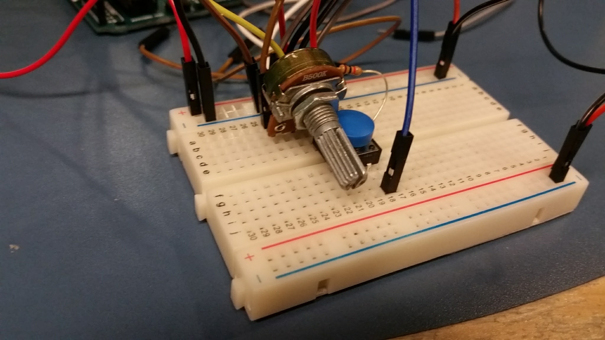
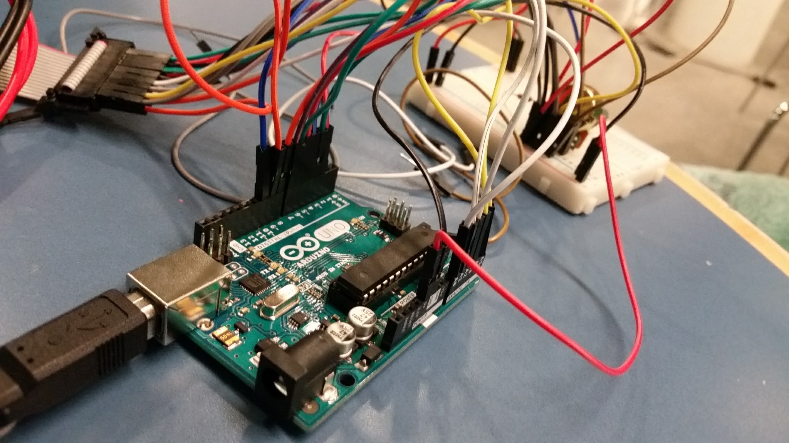
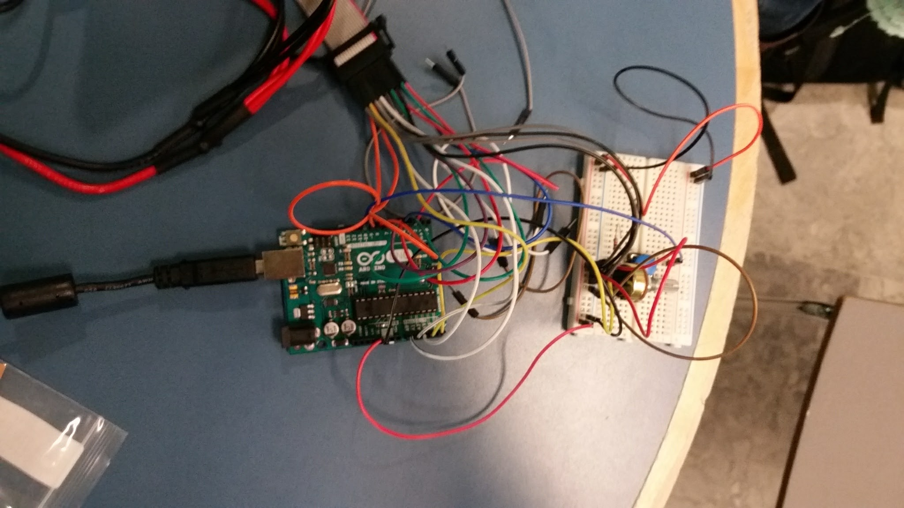
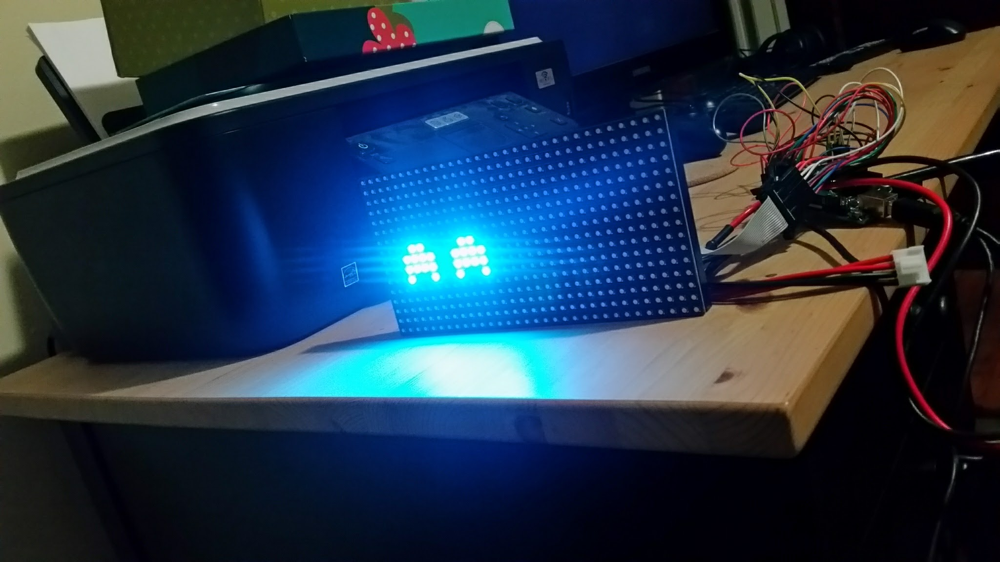
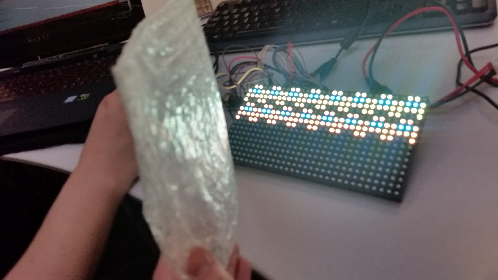
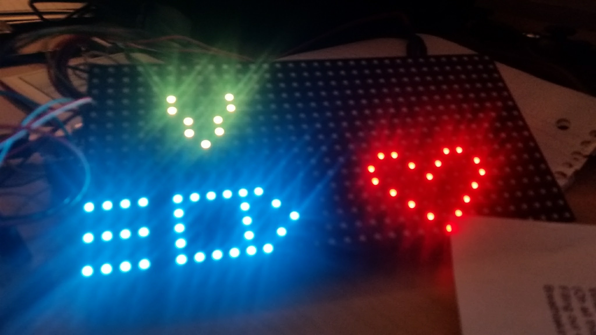

# Arduino Space Invaders

This was a college project that I spent some time elaborating on after the showcase. It served as a great introduction to microcontrollers. I ended up adding a leveling system (because everything I make always ends up turning into an RPG) and I even created an endless mode in which you could purchase power ups.

The potentiometer we had was kind of screwy. I think we even ended up replacing it. It had a lot of half-step glitches we were noticing early on.

Here it is in all of its ugliness. The "hardware."

Bird's eye view. Still just as ugly though.

I felt pretty cool when I first got this working. Little did I know I'd end up getting sucked into it and adding features we had no business adding.

"Kevin please put the bag down, dude, I just want to take a good picture."

Here's the aforementioned leveling system. Endless mode was fun to add. I learned a lot about working with digital displays so I got creative with my bullet speed and health powerups.

# Notes

I had to port this over from an old, failing hard drive. Some files are missing and I'm concerned some files may be corrupted. I'd like to see if I can recover the files from my backup drive but I'm not sure where it is at the moment. I'll upload the cleaner files if I find them.

